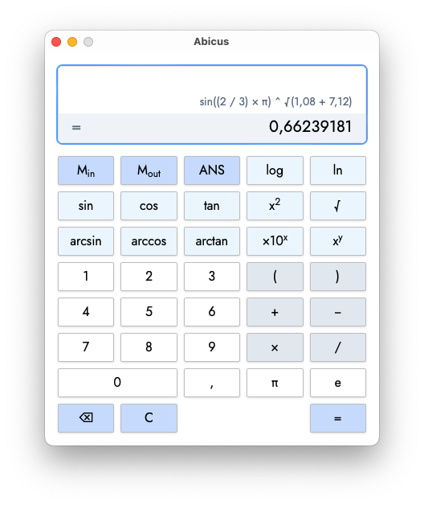

<h1 align="center">
  
  <div>AbiTeX</div>
</h1>

<div align="center">
AbiTeX is a modern, open-source scientific calculator based on the original Abicus project, now with full LaTeX input and calculation support.
<br />
<b>Supports fractions, roots, and advanced math via LaTeX syntax.</b>
<br />
Built for personal and general scientific use.
</div>

<div align="center">

</div>

---

## About AbiTeX

AbiTeX is a fork of Abicus, enhanced to support LaTeX math input and calculation. You can enter expressions like `\frac{2}{3}-1`, `\sqrt{2}` etc, and AbiTeX will calculate them directly. AbiTeX automatically converts LaTeX to mathjs and/or decimals in backend.

All the original Abicus features remain, with the addition of:
- LaTeX input for fractions, roots, powers, and more
- Unicode math symbol support (½, √, etc.)
- Seamless workflow for chaining calculations

AbiTeX is released under the MIT License. See below for original copyright.

---

<!--
[Installation]() ⋅
[User Guide]() ⋅
[Development Guide]()
-->

## Development Setup

Clone this repository and make sure you have [Node.js](https://nodejs.org/) installed on your system. The exact version used in development can be found in the [`.nvmrc` file](./.nvmrc).

If you want to develop the desktop application, you will additionally need to have a [Rust](https://www.rust-lang.org/) toolchain installed on your system. Please then also follow the [Tauri set-up instructions for your system](https://tauri.app/v1/guides/getting-started/prerequisites/).

When Node.js is ready and this repository has been cloned, install the packages by running the following in the cloned directory:

```bash
npm install
```

After all the required packages have been installed, run one of the following commands to start the development server:

- For the web-application only:

  ```bash
  npm run dev
  ```

- For the web-application and the desktop application:
  ```bash
  npm run tauri dev
  ```

## Tests

This project uses the [Vitest testing framework](https://vitest.dev) for unit tests and [Playwright](https://playwright.dev) for UI tests. After the project has been [set up](#installation), to run all the tests for the project you can simply run:

```bash
npm run test
```

To run only the unit tests:

```bash
npm run test:unit
```

And to only run the UI tests:

```bash
npm run test:ui
```

Please see the Vitest and/or Playwright documentation for details on e.g. how to filter which tests to run etc.

---

</table>
